# Fantastic News

Fantastic News is an imaginary news site that brings you the most untrustworthy stories in the world.
The sole purpose of this website is to demonstrate my coding knowledge and to entertain, no stories should be taken seriously.

# Live Page
[https://fantastic-news.herokuapp.com/](https://fantastic-news.herokuapp.com/)

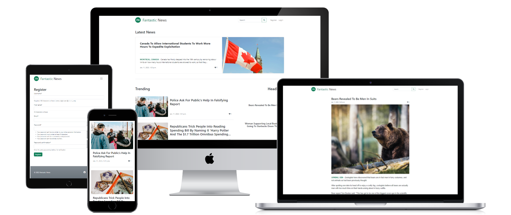

# Objective
The objective of this project is to present my skills in Django, Python, Object Oriented Programming, 
and other standard programming constructs such as flow control, iteration, selection, functions, and data structures.
In this project, I have also implemented tests with Django and Playwright.

# Contents
* [Features](#features)
  * [Navigation Bar](#navigation-bar)
  * [Search](#search)
  * [Latest News](#latest-news)
  * [Main Article List](#main-article-list)
  * [Secondary Article List](#secondary-article-list)
  * [Article Detail](#article-detail)
  * [Add Likes](#add-likes)
  * [Comments](#comments)
    * [Add Comment](#add-comment)
    * [Edit Comment](#edit-comment)
    * [Delete Comment](#delete-comment)
  * [Register](#register)
    * [Validation](#validation)
  * [Login](#login)
  * [Footer](#footer)
  * [Additional Features](#additional-features)
* [Colors](#colors)
* [Testing](#testing)
  * [Manual Testing](#manual-testing)
  * [Automated Testing](#automated-testing)
    * [Run Playwright Test](#run-playwright-test)
    * [Results](#results)
  * [Validation](#validation)
    * [Python](#python)
    * [HTML](#html)
    * [CSS](#css)
    * [JS](#js)
  * [Bugs](#bugs)
* [Development process](#development-process)
  * [Development Preparation](#development-preparation)
  * [Agile Development](#agile-development)
  * [Git](#git)
  * [SCSS](#scss)
* [Deployment](#deployment)
  * [Deployment Preparation](#deployment-preparation)
  * [Setup](#setup)
* [Credits](#credits)
  * [Used Technologies and Tools](#used-technologies-and-tools)
  * [Django Apps](#django-apps)
  * [Content and Media](#content-and-media)
* [Acknowledgments](#acknowledgments)

# FEATURES

## Navigation Bar
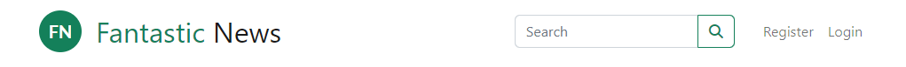
- The navigation bar is the first element on all three pages.
- It is fully responsive and includes the Fantastic News logo and name on the left and a search input and member links on the right.
- The logo is wrapped in a link and can be used to navigate to the homepage.
- The navigation bar is identical on each page to allow for easy navigation from page to page across all devices.  

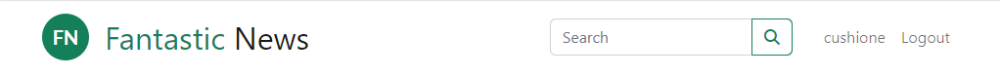
- After logging in, the links on the right side are replaced by the username and a log-out button.
- The user can always see if they are logged in by their username being displayed. 

## Search 

- The user can search for specific articles containing chosen keywords.
- To get a match, the article has to contain selected keywords in either the article title, location, or content.
- After sending off the search request, they are navigated to the page displaying the search result. 
- In case there is no match, the page informs the user of the fact by displaying a message.

## Latest News

- At the top of the homepage, the user can find the latest published article. 
- The article is full-width and shows the title, cover image, and a small preview of the content.
- It also shows the date and time of publishing and the number of likes and comments, if there are any.
- The latest article stands out compared to the rest of the articles on the page since the latest news is the most interesting for new and returning users.
- When a new story is posted, the previous latest article moves down into the main article list.

## Main Article List
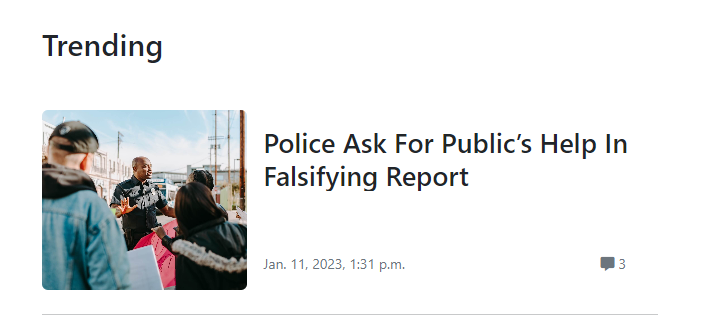
- Underneath the latest news, taking about two-thirds of the width, lies the main article list.
- The list is paginated, showing four articles on every page.
- Every article in the list shows a title and cover image of the article.
- It also shows the date and time of publishing and the number of likes and comments, if there are any.
- In the main article list are feature stories with a long relevance and value. 

## Secondary Article List

- Next to the main article list, taking the rest of the page, lies the secondary article list.
- The list shows the title of the article and no images.
- In the secondary article list are smaller stories with a shorter relevance and value.

## Article Detail
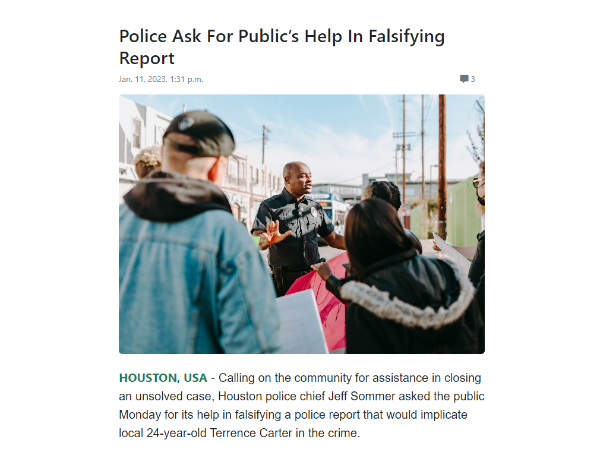
- Every article on the homepage can be opened by clicking on it.
- At the top, the detail page shows the title, date and time of publishing, and the number of likes and comments.
- Underneath, the cover image and content of the article are displayed.

- Below the content, a link to the original article is shown, if applicable, which opens in a new tab.

## Likes

- At the bottom of every article, a like button is shown to authenticated users.
- Upon clicking the button, the user is added to the list of users that like the article.
- The user can unlike the article by simply clicking the button again.

## Comments
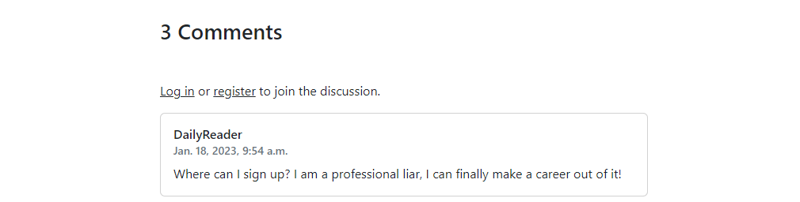
- Every article has a comment section on the detail page.
- At the top of the section, a title shows the number of comments.
- If the user is not authenticated, a hint shows that the user needs to log in or register to join/start a discussion.

### Add Comment

- If the user is authenticated, a comment form is displayed instead of the hint.
- The user can enter the content of the comment and post it by clicking the button.

### Edit Comment
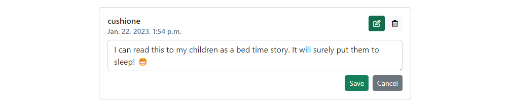
- The user can edit their comment by clicking the edit button in the top right corner.
- The comment turns into an inline form allowing the user to edit the comment.
- To save the changes, the user can click on the save button.
- A message notifies the user about the successful edit.
- If the user changes their mind, and does not want to edit the comment any longer, they can drop the changes by clicking the cancel button.

### Delete Comment
- The user can remove their comments permanently from the conversation.
- To delete a comment, the user can click on the delete button in the top right corner of the comment.
- Before deleting, the user has to confirm their decision, otherwise, the comment will not be deleted.
- A message notifies the user about the successful deletion.

## Register

- If a user wants to use the features reserved for members of the website, such as commenting and liking, they have to register.
- The user can reach the registration page by the link in the navigation bar or through links available throughout the website.
- To become a member, the user has to enter a username, first name, email, and password.
- If the provided data is valid, the user is automatically logged in and redirected to the page they were on before.

### Validation

- If the entered data is invalid when sent off, the form loads again with an error message. 
- The form data, apart from the password, is preserved and the invalid fields are highlighted with an error message below.
- After fixing the invalid fields and reentering the password, the user can send the form again.

## Login
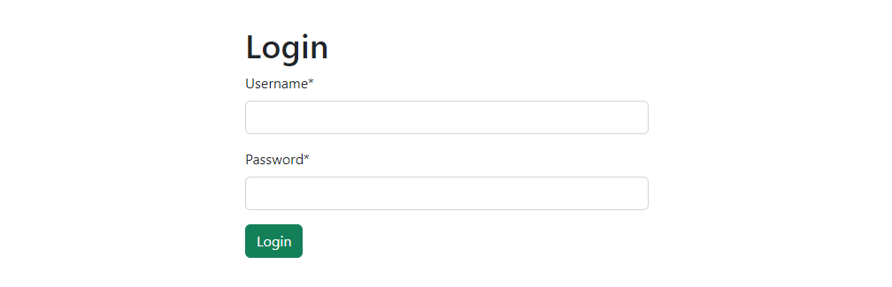
- If an unauthenticated member wants to use the features reserved for members of the website such as commenting and liking, they have to log in.
- The member can reach the login page by the link in the navigation bar or through links available throughout the website.
- To log in, the user has to enter their username and password.
- If the username and/or password are incorrect, the form is loaded again, informing the user about the error.

## Footer
- Every page has a footer at the bottom of the page.
- The footer shows the copyright text and links to four different social media websites. Each link opens in a new tab.

## Additional Features
Features that could be implemented in the future:
- Allow users to reply directly to another comment. Replies would then be shown directly underneath that comment as a conversation.
- Allow users to upvote/downvote comments and show the most popular comment on top instead of the most recent.
- Add news categories.

# Colors
The website uses only one green color next to the standard Bootstrap success, warning, and error colors: #14805a  
The color is used as an accent color.

# Testing
In this project, I used two types of testing: Manual explorative testing and semi-automated tests.

## Manual Testing
- Throughout the development process, I manually tested every page and feature exhaustively.   
[List of manual tests](manual_testing.md)
- When I finished creating my MVP, I shared the website with multiple users to confirm its functionality and to get feedback on their experience.

## Automated Testing
- For all my views, models, and forms, I implemented tests with the Django framework.
- For all my pages and features, I created semi-automated end-to-end tests with the [Playwright framework](https://playwright.dev/).
  - The tests cover the functionality of all pages and the elements within.
  - The tests use a separate test database instead of the production database.
  - The tests are run in three different types of browsers: Chromium, Firefox, and WebKit.

### Playwright Tests
- To install and setup Playwright, I ran the command `npm init playwright@latest --yes -- --quiet --browser=chromium --browser=firefox --browser=webkit --gha --install-deps` and `npm install dotenv`.
- Afterwards, I started the django app in my test environment with the command `ENV=TEST python3 manage.py runserver`.
This starts the project with an alternative test database. 
- When django started, I made the port of the app public. To do that, I went to the "PORTS" tab in Gitpod and clicked on the lock in the row of the django port, port 8000.
- Then, I started the tests with `npx playwright test`.

### Django Tests
- The Django framework includes a testing library, so no further setup is necessary.
- I started the Django tests with the command `python3 manage.py test`.

### Results
Test results from the Playwright tests: All 63 tests passed (21 tests in three browsers).  

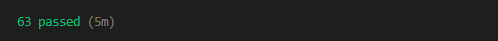

[Visual results with Playwright VSCode extension](assets/docs/automated_tests_result.png)

---

Test results from the Django tests: All 25 tests passed.  

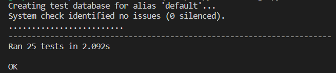

## Validation
### Python
  
There were no errors found in any of my python files using the [Python Linter provided by the Code Institute](https://pep8ci.herokuapp.com/).

### HTML
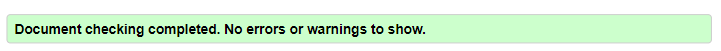  
There were no errors found on any page using the W3C HTML Validator.

### CSS
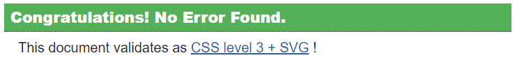  
There were no errors found in the stylesheet using the W3C CSS Validator.

### JS
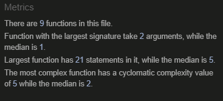  
There were no errors found in the javascript using the JS Hint Validator.

## Accessibility
There were no accessibility errors found using the [WAVE WebAIM web accessibility evaluation tool](https://wave.webaim.org/report#/https://fantastic-news.herokuapp.com/) 

## Lighthouse Report
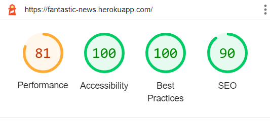
The website was tested with Google Lighthouse. The performance could be improved slightly by adding image transformations to the Cloudinary image upload in order to reduce the resolution and size.

## Bugs
There are no known unfixed bugs.

### Fixed Bugs
- When posting a comment, if the user pressed the submit button multiple times, a new comment was added for each click.
  - Fixed by adding an event listener to every form, which prevents multiple submissions.

## Development process
While I was working on this project, I tried to follow an agile development approach as much as possible. 

### Development Preparation
The first step in my development process was to plan the website thoroughly:
- At first, I created a simple class diagram that shows the models I was planning on implementing, with their properties and relations  
  [Link to the class diagram](https://drive.google.com/file/d/1Gynq42b4jLbzk4lR4uc5PLfOzMI7UWk4/view?usp=share_link)
- Next, I thought about the User Interface and its layout. I created simple [wireframes](assets/docs/wireframes.png) for the homepage, and the article detail page. 
For the registration and login page I was planning to use the default layout, so I omitted wireframes for those pages.
- Lastly, I wrote the majority of my user stories and tasks in my [GitHub Project](https://github.com/Cushione/fantastic-news/projects) 

### Agile Development
- In my GitHub Project, all my issues are separated into two milestones: "MVP" and "Additional Features".
- Issues not necessary for my project were added to the "Additional Features" milestone. Those tickets were only to be worked on when all the "MVP" tickets were done and I still had time left.
- Each issue was then categorized into user stories or technical tasks by adding the corresponding label.
- All the issues were then grouped into various epics by adding an "EPIC: _name_" label.
- When I was working on the project, I chose one issue to work on from the "Todo" column of the MVP board and moved it into the "In Progress" column.
- After I finished the issue by fulfilling all the acceptance criteria, I closed the issue which moved it automatically into the "Done" Column.

### Git
- I started the program and repository by using the [gitpod python template](https://github.com/Code-Institute-Org/python-essentials-template) provided by the Code Insitute.
- Then I regularly staged my changes using the command `git add <filename>` and then committed the staged changes to my local repository using `git commit -m 'short descriptive message here'`.
- Finally, I would push the commits from my local repository up to the GitHub repository using the command `git push`.
- With every push, Heroku automatically deploys my latest commit from the 'main' branch to the Heroku app.

### SCSS
- The styles in the project are written in scss stylesheets.
- The project uses the [django_sass_compiler](https://pypi.org/project/django-sass-compiler/) app to compile the scss file.
- When I changed any styles, I compiled and compressed the stylesheet with the command `python3 manage.py sass-compiler`.

# Deployment

The site was deployed using Heroku.

## Deployment Preparation
Before the deployment, the following steps were taken to prepare the application for the deployment on Heroku:
- The setting DEBUG in the settings.py was set to FALSE.
- All the dependencies were stored in the requirements.txt file with the command `pip3 freeze --local > requirements.txt`.
- The start command for the application `web: gunicorn newsbox86.wsgi` was stored in a Procfile.

## Setup
The steps to deploy an app to Heroku are as follows:
- Create a new App from the Heroku dashboard.
- Enter a name for the app and select a region, then click on "Create App".
- On the page of the app that opens, go to the "Settings" tab.
- In Settings add the necessary config vars, for this project I added my cloudinary URL, database URL, and django secret key
- Next, add the buildpack "Heroku/Python".
- Afterwards, go to the "Deploy" tab on the app page.
- In the "Deployment method" section, select "GitHub" and follow the steps to connect Heroku with GitHub.
- Then, in the "Connect to GitHub" section, search for the repository that is supposed to be deployed and click on "Connect".
- The last step is to either:
    - enable automatic deployment by clicking on the button "Enable Automatic Deploys" in the "Automatic Deploys" Section.
    - deploy a branch manually by selecting the branch and clicking the button "Deploy Branch" in the "Manual deploys" section.

The live link can be found here: [Fantastic News](https://fantastic-news.herokuapp.com/)

# Credits

## Used Technologies and Tools
- [Django](https://www.djangoproject.com/) - As the project framework
- [Bootstrap](https://getbootstrap.com/) - As the CSS framework
- [Playwright](https://playwright.dev/) - For writing end-to-end tests
- [Black](https://black.vercel.app/) - For formatting Python code
- [Prettier](https://prettier.io/) - For formatting Javascript code
- [Heroku](https://www.heroku.com/) - For the deployment of the website
- [ElephantSQL](https://www.elephantsql.com/) - As the database provider
- [Cloudinary](https://cloudinary.com/) - As the image storage

## Django Apps
- [django-sass-compiler](https://pypi.org/project/django-sass-compiler/) was used to compile scss files
- [django-crispy-forms](https://pypi.org/project/django-crispy-forms/) was used to style the login and registration form
- [django-summernote](https://github.com/summernote/django-summernote) was used as the WYSIWYG editor in the admin panel
- [cloudinary_storage and cloudinary](https://pypi.org/project/django-cloudinary-storage/) was used as the image storage

## Content and Media
- All the articles were copied from the following pages:
  - [The Onion](https://www.theonion.com/)
  - [The Babylon Bee](https://babylonbee.com/)
  - [The Daily Mash](https://www.thedailymash.co.uk/)
  - [The Beaverton](https://www.thebeaverton.com/)
- All the images were downloaded from:
  - [Unsplash](https://unsplash.com/)
  - [Pexels](https://www.pexels.com/)
- All the icons on the website are from [FontAwesome](https://fontawesome.com/)

# Acknowledgements

I would like to acknowledge the following people who have helped me along the way in completing my fourth portfolio project:
- My husband, Moritz Wach, for all his knowledge and relentless support.
- My mentor, Spencer Barriball, for his guidance and inspiration.
- My friends and colleagues for testing the website rigorously and leaving/editing/deleting comments.